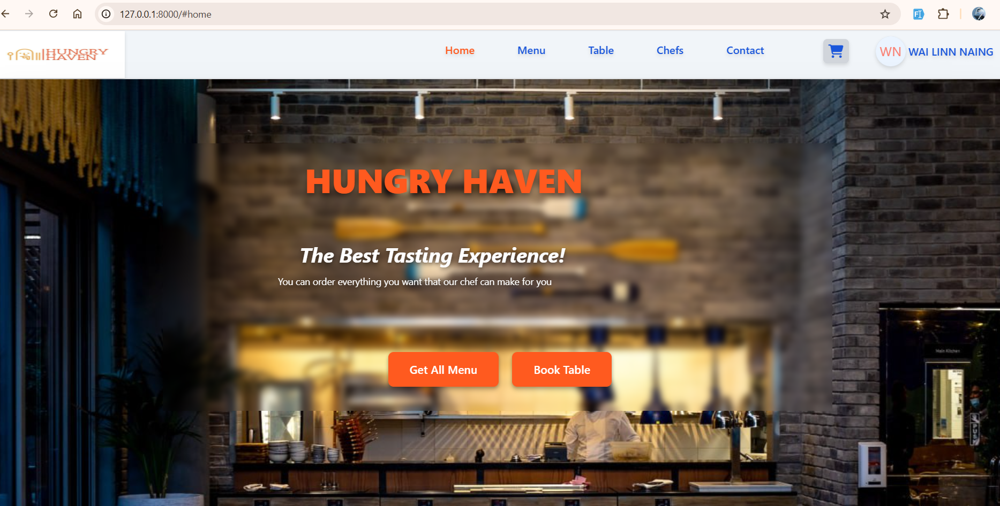
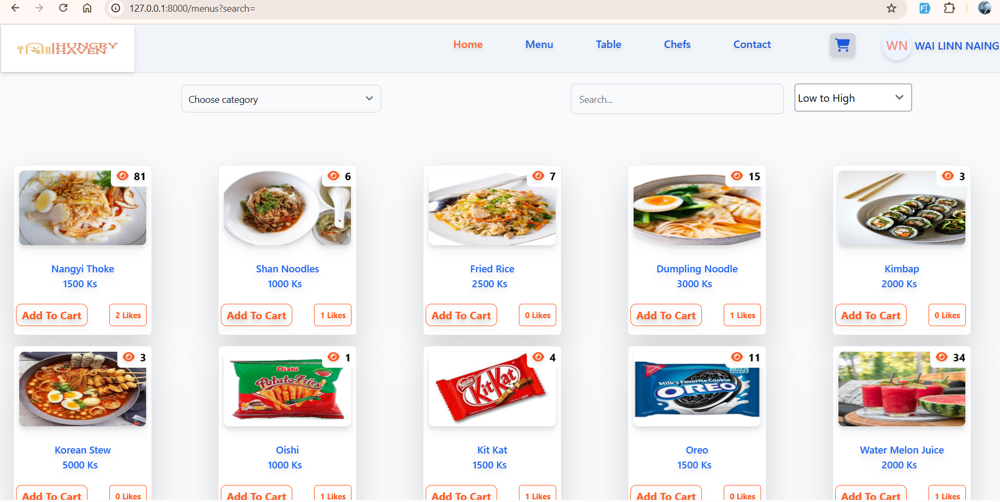
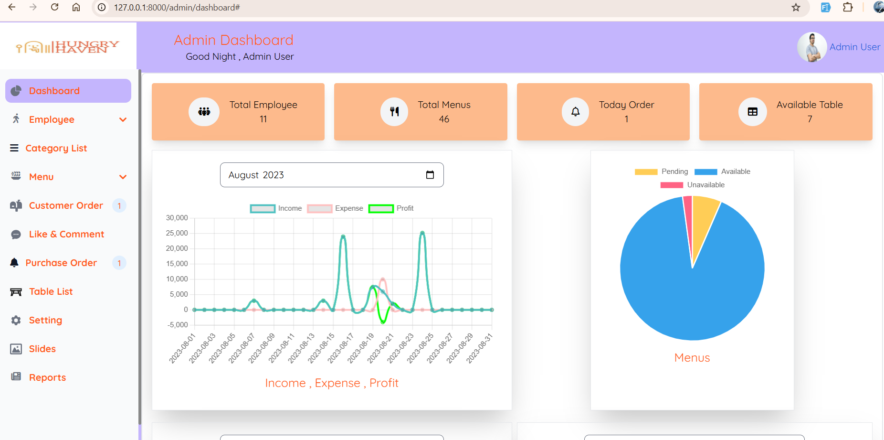
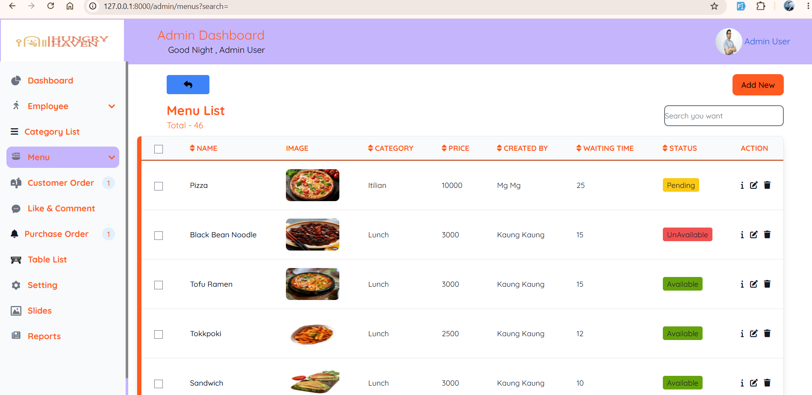
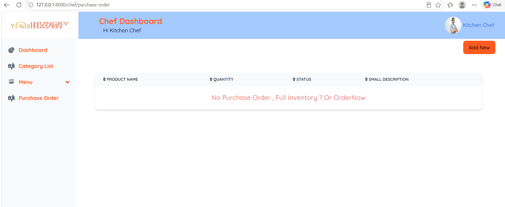
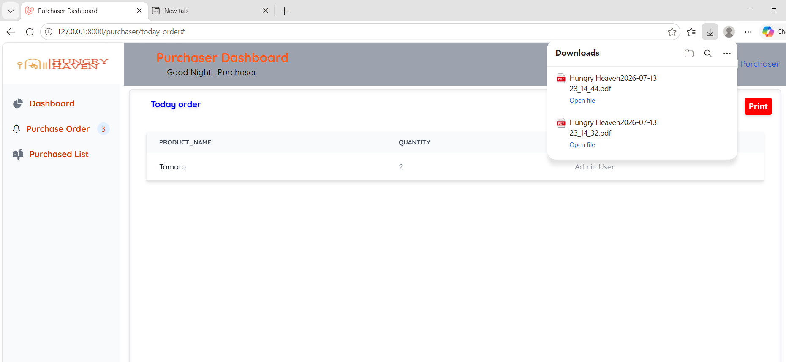

<p align="center">
  
</p>

<p align="center">
  
  
  
  
  
  
</p>

<h1 align="center">🍽️ Hungry Haven</h1>

<h3 align="center">Restaurant & Canteen POS & Management System</h3>

<p align="center">
  A full-stack, role-based restaurant management platform built with <strong>Laravel 10</strong>.
  Handles customer self-service ordering, kitchen operations, purchase management, and admin oversight — all from one integrated system.
</p>

<p align="center">
  <a href="#features">Features</a> ·
  <a href="#tech-stack">Tech Stack</a> ·
  <a href="#architecture">Architecture</a> ·
  <a href="#installation">Installation</a> ·
  <a href="#screenshots">Screenshots</a>
</p>

---

##  Overview

**Hungry Haven** is a comprehensive restaurant management system designed to streamline operations across multiple roles. Rather than separate systems for ordering, kitchen management, and admin tasks, everything lives on one platform with proper access control.

**What it does:**

- Lets customers browse menus, place orders, book tables, and interact with dishes (likes/comments)
- Gives admins full control over menus, employees, settings, orders, and analytics
- Provides chefs with focused views on menu items and incoming purchase orders
- Enables purchasers to manage stock orders and export PDFs

**Why I built it this way:**

- Used a single Laravel codebase with role-based guards instead of separate apps — reduces duplication and keeps the data model consistent
- Chose Livewire for admin interfaces because it lets me build dynamic CRUD interfaces in PHP without writing a separate API or JavaScript frontend
- Separated `User` (customer) and `Employee` (staff) into two models with two guards (`web` and `staff`) so authentication concerns are cleanly isolated
- Used a custom `RoleMiddleware` to keep authorization logic centralized and reusable across all routes

---

##  Features

### Customer Portal

| Feature | Implementation Detail |
|---------|----------------------|
| **Hero Homepage** | Swiper.js slider with dynamic promotional slides managed from admin |
| **Menu Browser** | Filterable by category, with like counts, image galleries, and pricing |
| **Cart & Orders** | Full cart flow with order placement and status tracking |
| **Table Booking** | Visual table selection with availability display |
| **Comments & Likes** | Eloquent relationships with pivot-style like/comment models |
| **Google OAuth** | Socialite integration for one-click customer login |
| **Dark Mode** | Client-side theme toggle with Tailwind dark classes |
| **Contact Form** | Form submission with SweetAlert2 notifications |

### Admin Panel

| Feature | Implementation Detail |
|---------|----------------------|
| **Analytics Dashboard** | Chart.js integration via Livewire for sales, customer, and menu metrics |
| **Menu Management** | Livewire CRUD with multiple image upload per menu item |
| **Category Management** | Filter and organize menu items by category |
| **Table Management** | Livewire components for restaurant table creation/editing |
| **Employee Management** | Staff creation with role assignment (admin, chef, purchaser) |
| **Site Settings** | Centralized settings model for about us, contact info, and site images |
| **Slider Management** | Admin-controlled homepage promotional slides with discount badges |
| **Order Management** | View customer orders, generate invoices, send via email |
| **Purchase Orders** | Track and manage stock purchase orders across admin, chef, and purchaser |
| **Reports** | Income and expense reporting with date-filtered queries |
| **Comment/Like Moderation** | Manage customer-generated content |

### Chef Panel

| Feature | Implementation Detail |
|---------|----------------------|
| **Kitchen Dashboard** | Overview of kitchen operations and pending orders |
| **Menu View** | View active menus and categories for preparation |
| **Purchase Orders** | View incoming stock orders from purchaser |

### Purchaser Panel

| Feature | Implementation Detail |
|---------|----------------------|
| **Purchase Dashboard** | Overview of purchase activities |
| **Order Management** | Create and update purchase orders with pricing and quantity |
| **PDF Export** | DomPDF integration for daily purchase order reports |
| **Shift-Based Filtering** | Orders filtered by kitchen shift schedule (4 PM–7 AM boundary handling) |

---

## 🛠 Tech Stack

| Category | Technology | Why I Chose It |
|----------|-----------|----------------|
| **Backend** | Laravel 10 | Rapid development, built-in auth, Eloquent ORM |
| **Language** | PHP 8.1+ | Type-safe, modern PHP features |
| **Dynamic UI** | Livewire 2 | Build reactive interfaces in PHP without separate API layer |
| **Styling** | Tailwind CSS 3 | Utility-first, consistent design system |
| **Auth** | Laravel Breeze + Sanctum | Session-based web auth + API token support |
| **Database** | MySQL | Relational data, complex queries for orders/reports |
| **PDF** | DomPDF | Server-side invoice generation |
| **Frontend** | Swiper.js, SweetAlert2, Chart.js | Slider, notifications, and analytics |
| **Social Auth** | Laravel Socialite | Google OAuth for customer login |
| **SMS** | Twilio / Vonage | Order notifications (optional integration) |

---

## 🏗 Architecture

### Authentication Strategy

The application uses **two separate authentication guards** to keep customer and staff authentication isolated:

```
Guard: web     → Model: User        → Used by: Customers
Guard: staff   → Model: Employee    → Used by: Admin, Chef, Purchaser
```

This separation means:
- Customers can't access staff routes and vice versa
- Session and cookie handling is independent
- Password resets and auth logic can differ per guard

### Authorization

A custom `RoleMiddleware` handles role-based access:

```php
// routes/auth.php
Route::prefix('/admin')->middleware(['auth:staff', 'role:admin'])->group(function () {
    // Only accessible to employees with role_as = 'admin'
});
```

The `role_as` column on `employees` table determines access level:

| Value | Access |
|-------|--------|
| `admin` | `/admin/*` routes |
| `chef` | `/chef/*` routes |
| `purchaser` | `/purchaser/*` routes |

### Key Design Decisions

| Decision | Rationale |
|----------|-----------|
| **Livewire over Vue/React** | Faster development for CRUD-heavy admin panel, no need for separate API endpoints |
| **Single database** | Shared data model (menus, orders) across all roles without sync complexity |
| **Carbon with Asia/Yangon timezone** | Purchase orders follow the kitchen's actual shift schedule |
| **Storage symlink for uploads** | Standard Laravel approach; uploaded images served via `asset('storage/...')` |
| **Swiper.js for slider** | Touch-friendly, lightweight, no jQuery dependency |

---

## 🗄 Database Schema

### Core Tables

| Table | Purpose |
|-------|---------|
| `users` | Customer accounts with Google ID and profile image |
| `employees` | Staff accounts with role, schedule, and role assignment |
| `menus` | Menu items with pricing, status, discount, and timestamps |
| `categories` | Menu categories for filtering |
| `menu_images` | Multiple images per menu item (one-to-many) |
| `restaurant_tables` | Table definitions with images for booking UI |
| `orders` | Customer order headers with status tracking |
| `order_details` | Individual items within each order |
| `carts` | Customer shopping cart items |
| `comments` | Customer comments on menus |
| `likes` | Customer likes on menus (like/unlike toggle) |
| `slide_settings` | Admin-managed homepage promotional slides |
| `settings` | Restaurant info: about us, contact, address, images |
| `purchase_orders` | Stock/ingredient purchase tracking with shift logic |

### Relationships

```
User (customer)
  ├── hasMany Cart
  ├── hasMany Comment
  ├── hasMany Like
  └── hasMany Order

Menu
  ├── belongsTo Category
  ├── hasMany MenuImage
  ├── hasMany Comment
  ├── hasMany Like
  └── belongsToMany Order (via OrderDetail)

Employee (staff)
  └── role_as → determines guard access

Order
  ├── belongsTo User
  └── hasMany OrderDetail

OrderDetail
  ├── belongsTo Order
  └── belongsTo Menu
```

---

##  Installation

### Prerequisites

- PHP >= 8.1
- Composer
- MySQL 8.0+
- Node.js & npm
- Web server (Apache/Nginx) or built-in PHP server

### Setup Steps

```bash
# 1. Clone the repository
git clone https://github.com/yourusername/hungry-haven.git
cd hungry-haven

# 2. Install PHP dependencies
composer install

# 3. Install npm dependencies
npm install

# 4. Create environment file
cp .env.example .env

# 5. Generate application key
php artisan key:generate

# 6. Configure .env with your database credentials
# DB_CONNECTION=mysql
# DB_HOST=127.0.0.1
# DB_PORT=3306
# DB_DATABASE=project_canteen
# DB_USERNAME=root
# DB_PASSWORD=

# 7. Create storage symlink
# Linux/macOS:
php artisan storage:link
# Windows (run terminal as Administrator):
php artisan storage:link

# 8. Run migrations and seed demo data
php artisan migrate:fresh --seed

# 9. Compile frontend assets
npm run build

# 10. Start the development server
php artisan serve
```

**Visit:** `http://localhost:8000`

---

##  Configuration

### Environment Variables

```env
APP_NAME="Hungry Haven"
APP_ENV=local
APP_DEBUG=true
APP_URL=http://localhost:8000

FILESYSTEM_DISK=local

# Google OAuth (optional)
GOOGLE_CLIENT_ID=your_client_id
GOOGLE_CLIENT_SECRET=your_client_secret
GOOGLE_REDIRECT=http://localhost:8000/auth/google/callback

# Twilio SMS (optional)
TWILIO_SID=your_sid
TWILIO_TOKEN=your_token
TWILIO_PHONE=your_phone
```

### Required Middleware

Ensure `RoleMiddleware` is registered in `app/Http/Kernel.php`:

```php
protected $routeMiddleware = [
    // ...
    'role' => \App\Http\Middleware\RoleMiddleware::class,
];
```

---

##  Demo Credentials

Populated by `StaffSeeder`. Run `php artisan migrate:fresh --seed` to create them.

| Role | Email | Password | Dashboard Route |
|------|-------|----------|-----------------|
| Admin | `admin@canteen.com` | `admin123` | `/admin/dashboard` |
| Chef | `chef@canteen.com` | `chef123` | `/chef/dashboard` |
| Purchaser | `staff@canteen.com` | `staff123` | `/purchaser/dashboard` |

> These accounts are for local development only. Replace with strong credentials in production.

---

## 📸 Screenshots

### Customer Homepage
<p align="center">
  
  <br><em>Homepage with hero slider, today's specials, chef profiles, and table booking</em>
</p>

### Customer Menu Browser
<p align="center">
  
  <br><em>Browse menus by category with images, prices, and like counts</em>
</p>

### Admin Dashboard
<p align="center">
  
  <br><em>Admin dashboard with sales, customer, account, and menu analytics charts</em>
</p>

### Admin Menu Management
<p align="center">
  
  <br><em>Admin panel for creating and managing menu items with image uploads</em>
</p>

### Chef Purchase Order Page
<p align="center">
  
  <br><em>Chef view of incoming purchase orders</em>
</p>

### Purchaser Purchase Order Page
<p align="center">
  
  <br><em>Purchaser panel for managing and pricing purchase orders with PDF export</em>
</p>

---

## 📁 Project Structure

```
canteen_pos/
├── app/
│   ├── Http/
│   │   ├── Controllers/
│   │   │   ├── Admin/                        # Admin panel controllers
│   │   │   ├── Chef/                         # Kitchen panel controllers
│   │   │   ├── Customer/                     # Customer-facing controllers
│   │   │   ├── Purchaser/                    # Purchase management controllers
│   │   │   ├── Auth/                         # Login, registration, password reset
│   │   │   └── AuthenticatedSessionController.php  # Staff login entry point
│   │   ├── Livewire/                         # Livewire components (no separate API needed)
│   │   │   ├── Admin/                        # Admin CRUD interfaces
│   │   │   ├── Chef/                         # Chef interfaces
│   │   │   └── Customer/                     # Customer interfaces (cart, menu, tables)
│   │   └── Middleware/
│   │       └── RoleMiddleware.php            # Role-based access control (role:admin|chef|purchaser)
│   ├── Models/
│   │   ├── User.php                          # Customer model (web guard)
│   │   ├── Employee.php                      # Staff model (staff guard)
│   │   ├── Menu.php                          # Menu items with pricing and discount
│   │   ├── Order.php / OrderDetail.php       # Order management
│   │   ├── Cart.php                          # Shopping cart
│   │   ├── Like.php / Comment.php            # Customer engagement
│   │   ├── RestaurantTable.php               # Table booking
│   │   ├── SlideSetting.php                  # Homepage slider
│   │   ├── Setting.php                       # Site-wide settings
│   │   └── PurchaseOrder.php                 # Stock/ingredient orders
│   └── Providers/
│       └── RouteServiceProvider.php          # Route constants (ADMIN_HOME, CHEF_HOME, PURCHASER_HOME)
├── config/
│   ├── auth.php                              # Two guards: web (User) + staff (Employee)
│   └── filesystems.php                       # Storage disk config (local + public)
├── database/
│   ├── migrations/                           # 25+ migrations covering all features
│   └── seeders/
│       ├── DatabaseSeeder.php                # Entry point
│       └── StaffSeeder.php                   # Demo staff accounts
├── public/
│   ├── storage/                              # Symlink → storage/app/public
│   ├── img/                                  # Static assets (logos, food photos)
│   └── build/                                # Compiled Vite assets
├── resources/
│   └── views/
│       ├── layout/                           # Shared layouts + nav/footer
│       ├── login/                            # Customer + staff login views
│       ├── admin/                            # Admin panel views
│       ├── chef/                             # Chef panel views
│       ├── customer/                         # Customer views (home, cart, menu)
│       └── purchaser/                         # Purchaser views + PDF templates
├── routes/
│   ├── web.php                               # Customer routes
│   └── auth.php                              # Staff login, admin, chef, purchaser routes
└── composer.json
```

---

##  Authentication & Authorization

### Two-Guard Architecture

Laravel's built-in auth is extended with a second guard for staff:

```php
// config/auth.php
'guards' => [
    'web' => [
        'driver' => 'session',
        'provider' => 'users',       // Customer accounts
    ],
    'staff' => [
        'driver' => 'session',
        'provider' => 'staffs',      // Employee accounts
    ],
],
```

### Role-Based Middleware

```php
// app/Http/Middleware/RoleMiddleware.php
public function handle($request, Closure $next, ...$roles)
{
    $user = Auth::guard('staff')->user();

    if ($user && in_array($user->role_as, $roles)) {
        return $next($request);
    }

    return redirect('/staff/login');
}
```

Applied in routes:

```php
Route::prefix('/admin')->middleware(['auth:staff', 'role:admin'])->group(function () {
    // Admin-only routes
});

Route::prefix('/chef')->middleware(['auth:staff', 'role:chef'])->group(function () {
    // Chef-only routes
});

Route::prefix('/purchaser')->middleware(['auth:staff', 'role:purchaser'])->group(function () {
    // Purchaser-only routes
});
```

---

##  Key Technical Highlights

| Feature | How It's Implemented |
|---------|---------------------|
| **Dynamic admin CRUD** | Livewire components handle form submission, validation, and database updates without page reloads |
| **Multi-image upload** | `MenuImage` model with one-to-many relationship; images stored via Laravel filesystem |
| **Order status workflow** | Status field tracks order progression; purchasers update stock orders, admins manage customer orders |
| **PDF invoices** | DomPDF loads Blade views with order data for downloadable PDFs |
| **Social login** | Laravel Socialite with Google OAuth; customer accounts created/updated on callback |
| **Real-time notifications** | SweetAlert2 for success/error messages; optional Twilio SMS for order updates |
| **Shift-aware reporting** | Carbon date logic handles kitchen shift boundary (4 PM–7 AM) for accurate daily reports |
| **Responsive design** | Tailwind CSS with custom breakpoints (`laptopsm`, `tablet`, `phone`) for all screen sizes |

---

## 🧪 Testing

```bash
# Run the application
php artisan serve

# Run database seeders
php artisan db:seed

# Clear caches
php artisan config:clear
php artisan view:clear
php artisan route:clear
```

---

## 📄 License

This project is open-source and available under the [MIT License](LICENSE).

---

<p align="center">
  Built with Laravel · Designed for real restaurant operations
</p>
